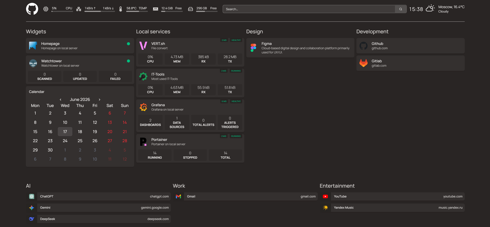

# Homelab Infrastructure Dashboard

A self-hosted homelab environment orchestrated via Docker Compose.
This repository contains the configuration files required to deploy a
centralized homepage alongside infrastructure management, monitoring,
and utility tools.



## Architecture & Services

The stack consists of the following components:

* **Dashboard ([`Homepage`](https://github.com/gethomepage/homepage))**: The primary application portal providing
  centralized access to all deployed services and real-time infrastructure status.
* **Infrastructure Management ([`Portainer`](https://github.com/portainer/portainer))**: Container management interface
  used for monitoring stacks, container lifecycles, and docker volumes.
* **Monitoring & Analytics ([`Grafana`](https://github.com/grafana/grafana), [`Prometheus`](https://github.com/prometheus/prometheus) + [`Node Exporter`](https://github.com/prometheus/node_exporter))**:
  * **Node Exporter**: Collects hardware and OS metrics from the host system.
  * **Prometheus**: Acts as the time-series database to ingest and store metrics.
  * **Grafana**: Visualizes the collected data via infrastructure dashboards.
* **Development Utilities ([`IT-Tools`](https://github.com/CorentinTh/it-tools))**: A collection of aggregated web-based
  tools for developers and system administrators.
* **Misc ([`VERT.sh`](https://github.com/VERT-sh/VERT), [`Watchtower`](https://containrrr.dev/watchtower/))**:
  * **VERT.sh**: File conversion utility that uses WebAssembly
    to convert files on your server instead of a cloud.
  * **Watchtower**: A container-based solution for automating
    Docker container base image updates.

## Prerequisites

* Docker Engine 20.10+
* Docker Compose v2.0+
* Python 3.11+
* Make (GNU Make 4.3)

## Quick setup

1. Clone the repository:

```bash
git clone git@github.com:Kaboupi/easy-homepage.git
cd easy-homepage
```

2. Configure environment variables (copy the template
and adjust system IPs/ports in `.env`):

```bash
cp .env.example .env
```

3. Create venv and install dependencies

```bash
# Creates Python3 virtual environment
make venv
```

4. Initialize the container stack

```bash
# Renders templates from .env
# and starts all the containers
make run
```
